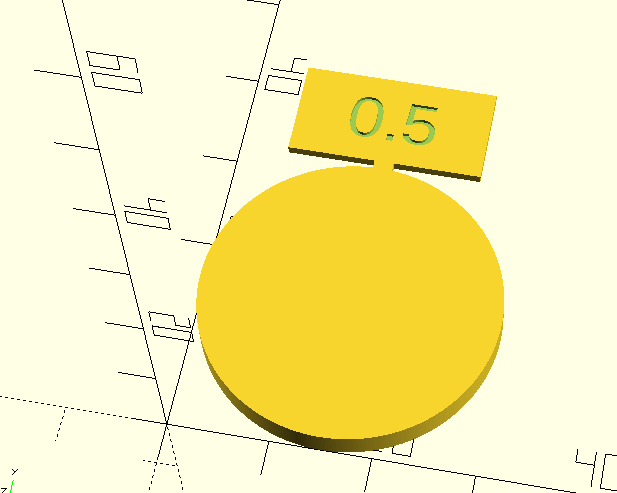

# Calibration disc

A simple disc used for calibrating Extrusion multiplier (EM).

Instead of the classical cube format, it's in the shape of a disc instead, so you can maybe reuse it in a disc launcher.

The top label is attached to the circle using a thin connection that can easily be removed.

## Pictures
