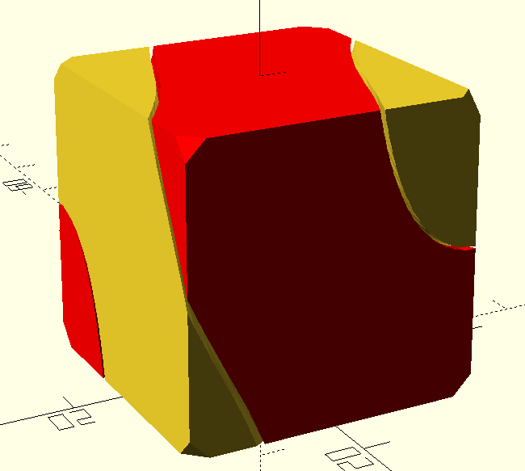
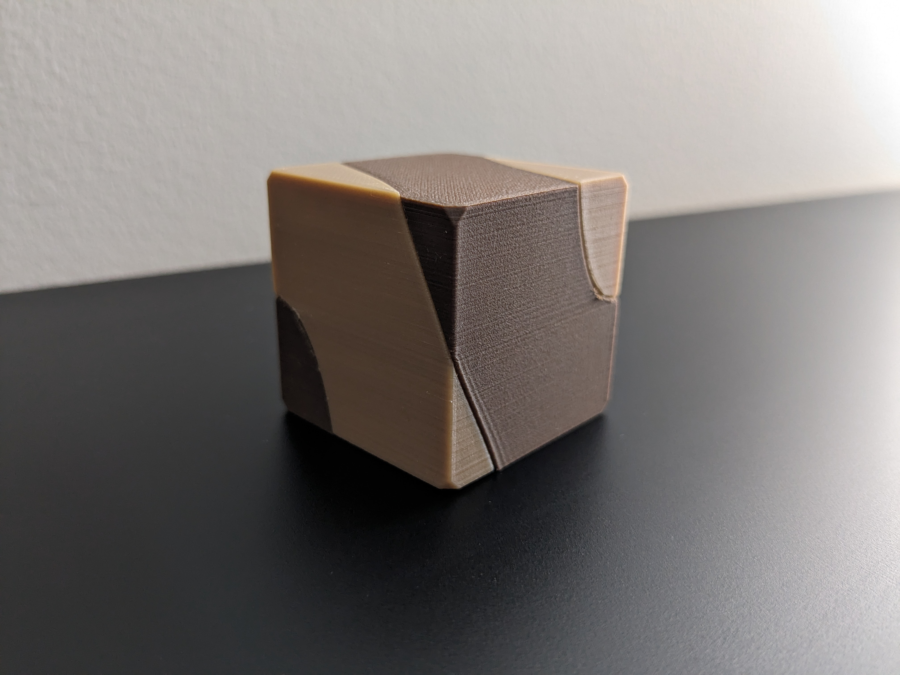

# Hart's Cube Puzzle - Remix

Remix on the Hart's Cube Puzzle (https://www.thingiverse.com/thing:2132796)

When playing with it the corners were a bit too pointy, so I added an option to chamfer the corner points

Modifications :
- Added chamfer to corners
- Added a gap value of 0.5 : When printing with a voron the gap of 1mm was too loose.

## Pictures

Printed with :
- 30mm size
- 0.12mm layer height
- 0.5 gap
- 2mm corner chamfer

## Model origin
Remix from the following design

https://www.thingiverse.com/thing:2132796/files
